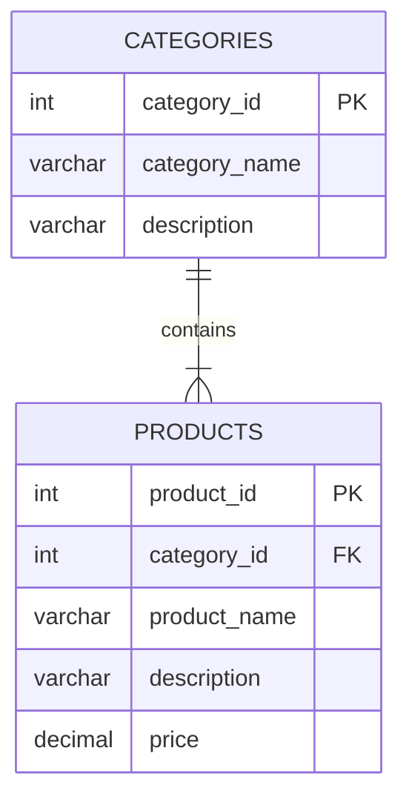
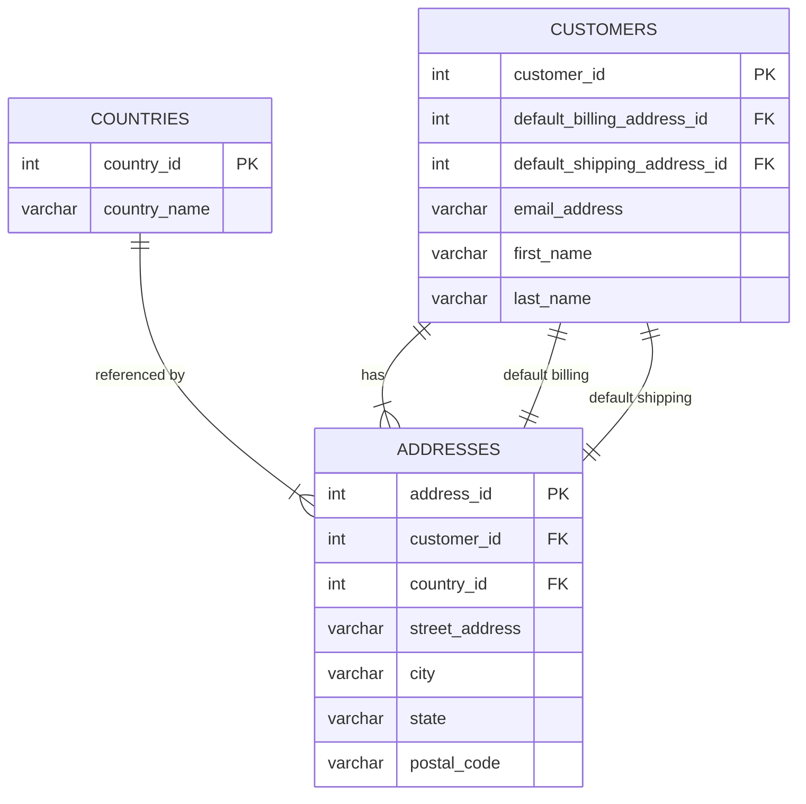
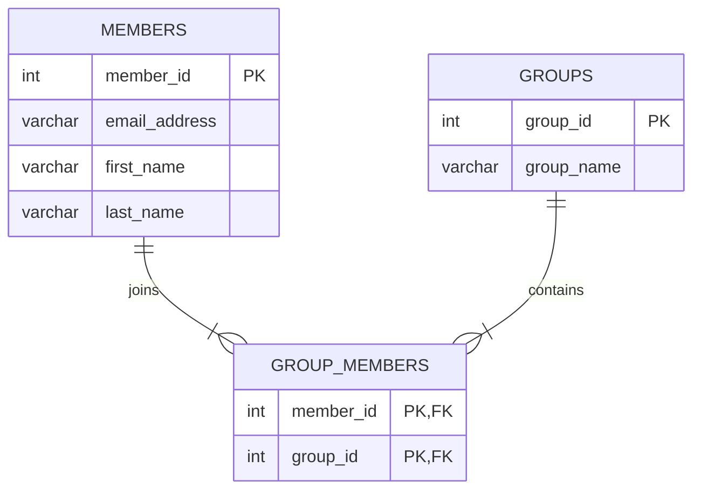
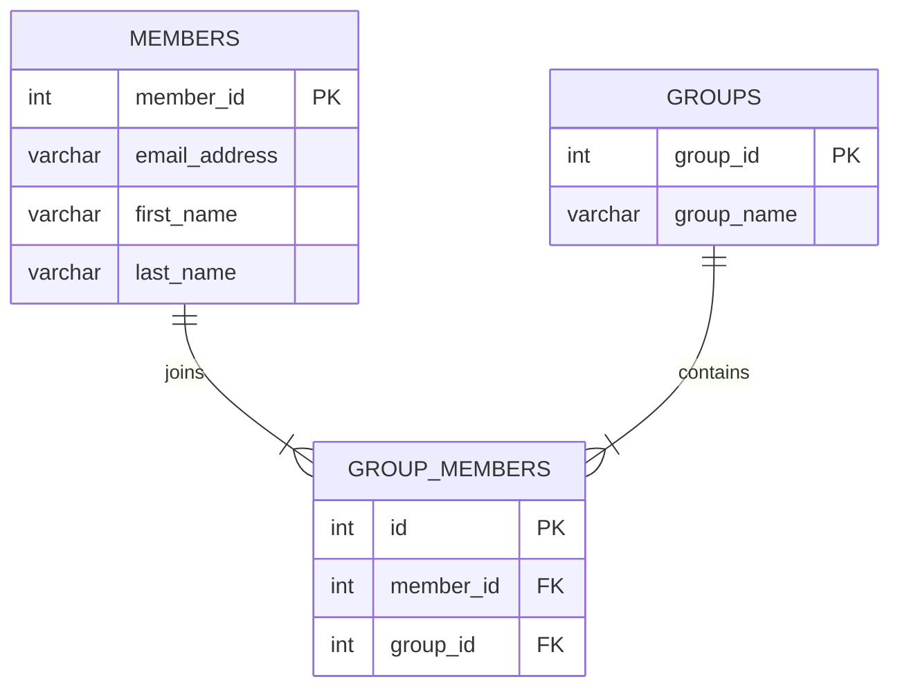

# Exercises 1-3 from Chapter 10, Section 1

## Exercise 1
Use MySQL Workbench to create an EER diagram for a database that stores information about products.

- Each product must have a product name, description, and price.
- Each product must belong to one category.
- Each category must have a category name and description.
- Each category can include multiple products.

### Explanation
- **One-to-Many Relationship**: The relationship between `CATEGORIES` and `PRODUCTS` is one-to-many (`1:N`). One category can contain multiple products, but each product belongs to exactly one category. This is represented by the crow's foot notation on the `PRODUCTS` side and a single hash on the `CATEGORIES` side.
- **Foreign Key**: The `PRODUCTS` table includes a `category_id` column which serves as a foreign key referencing the primary key of the `CATEGORIES` table, enforcing referential integrity.
- **Attributes**: All required attributes (names, descriptions, price) are included in their respective entities.

## Exercise 2
Use MySQL Workbench to create an EER diagram for a database that stores information about customers.

- Each customer must have an email address, first name, and last name.
- Each customer can have two or more addresses.
- Each customer can have a default billing address and a default shipping address.
- Each address must have a street address, city, state, postal code, and country.
- Each country name should be stored in one place only.

### Explanation
- **Customers and Addresses (1:N)**: A customer can have multiple addresses, so the `ADDRESSES` table contains a `customer_id` foreign key. This establishes a one-to-many relationship where one customer owns many address records.
- **Countries Reference**: To satisfy the requirement that country names are stored in only one place, a separate `COUNTRIES` table is created. The `ADDRESSES` table references `COUNTRIES` via `country_id`.
- **Default Addresses**: The `CUSTOMERS` table includes specific foreign keys (`default_billing_address_id`, `default_shipping_address_id`) that point back to specific rows in the `ADDRESSES` table. This allows the system to designate specific addresses as defaults for billing and shipping.

## Exercise 3
Use MySQL Workbench to create an EER diagram for a database that tracks the memberships for an association and for the groups within the association.

- Each member must have an email address, first name, and last name.
- Each member can belong to any number of groups.
- Each group must have a name.
- Each group can have any number of members.

or

### Explanation
- **Many-to-Many Relationship**: Members can belonging to multiple groups, and groups can have multiple members. This is a classic Many-to-Many (`M:N`) relationship.
- **Junction Table**: Relational databases cannot directly model M:N relationships. To resolve this, an intermediate "junction" or "associative" entity `GROUP_MEMBERS` was created. It works by breaking down the complex many-to-many relationship into two separate, manageable one-to-many relationships.
- **Composite Primary Key**: The `GROUP_MEMBERS` table typically uses a composite primary key made up of both `member_id` and `group_id`, ensuring that a specific member cannot join the same specific group more than once (preventing duplicates).

### Primary Key Design: Surrogate Key vs Composite Key

| Aspect | Surrogate Key (`enrollment_id`) | Composite Key (`student_id + course_id`) |
|--------|--------------------------------|------------------------------------------|
| **Simplicity** | Extra column | More concise schema |
| **FK References** | Single column | Must reference two columns |
| **ORM Support** | Better compatibility | Requires composite key class |
| **Index Size** | Smaller (single INT) | Larger (two INTs) |
| **Re-enrollment** | Supports multiple enrollments | One per student-course pair |
